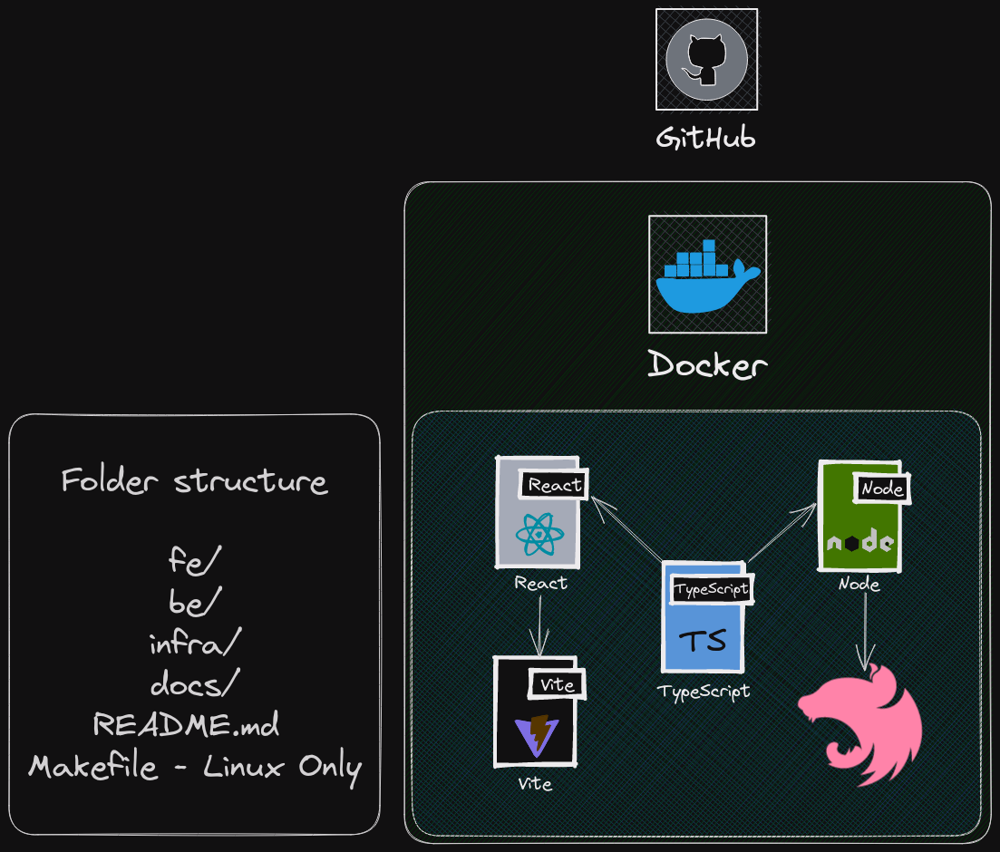

# Challenge Fulltimeforce 🔤

## Objective 🏁

The goal of this test will be to create an app that shows git commit history on the same project you are working on. You need to do well-stated and defined commits while working on this test and regularly push them up.

## Requirements 🧰

1. Use GitHub API - ✅
2. Repository must be public - ✅
3. Styles with tailwindcss - ✅
4. Framework must be NestJS - ✅
5. Provide a README.md with instructions on how to run the app - ✅

## Optional ❓

1. Reload information in real-time

## Run the project 🚀

#### Pre-requisites 📋

1. Node.js ^18.16.1

#### Optional 📋

1. Docker

## Documentation 📖

- For windows users check [docs/windows](./docs/windows.md)
- For linux users check [docs/linux](./docs/linux.md)
- For testing check [docs/test](./docs/test.md)